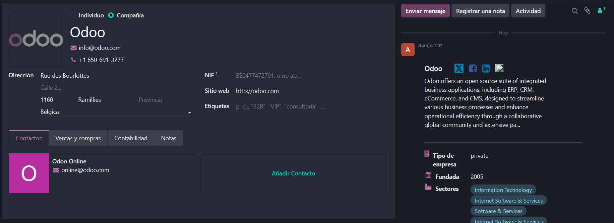

# 06 — Contactos

- Asociación automática persona/empresa.
  Al haber enlazado el api de gmail, Odoo agrega automáticamente los contactos de la bandeja de entrada del correo introducido. Los cuales se muestran en la applicación de contactos.Ejemplo de cointacto generado por el add-on de gmail:
  
  Por culpa de esto se puede dar el caso de que se dupliquen contactos, en ese caso tan solo ve a los ajustes de uno de los duplicados y dale a "fusionar", lo cual fusiona ambos contactos.
- **Etiquetas** para segmentar.
  Es importante crear etiquetas para poder filtrar contactos. Para crear una etiqueta tan solo tienes que darle a un contacto, darle a crear en el apartado de etiquetas, ponerle nombre y elegir un color.
  
  Esto ayuda a filtrar no solamente por empresas y personas sino también por cargos, etc.
- Importación CSV (ver `common/ejemplo_csv/`).
  Poder importar los archivos de contacto es muy importante para trasladarse entre ERPs, dico eso, para importar contactos, tan solo hay que seleccionar la opción con el mismo nombre en los ajustes de "contactos":
  
  Otra opción es importar hojas de calculo, las cuales son las que genera Odoo al exportar sus contactos.
