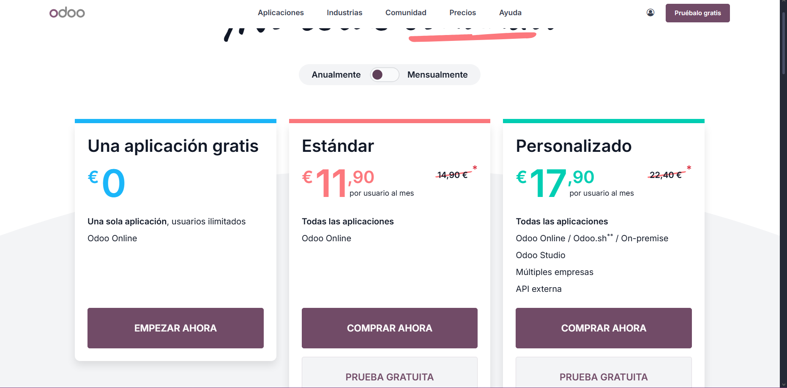

# 10 — Ediciones y costes

# 10 — Ediciones y costes

- **Community** (gratis, usuarios ilimitados, mantenimiento propio). Odoo Community destaca en proyectos que necesitan flexibilidad técnica y sirve en la situación donde el equipo quiere controlar el código y alojarlo por su cuenta.

- **Enterprise** (SaaS, soporte, actualizaciones, app móvil, Odoo Studio). Odoo Enterprise encaja cuando se busca servicio gestionado, soporte oficial y funcionalidades avanzadas.

- **Contrato anual** aunque el pago sea mensual. Esto viene bien en la situación donde se quiere reducir el coste mensual manteniendo un compromiso estable.

- **Prueba: máx. 10 apps**. Esto viene bien en la situación donde se desea evaluar el sistema antes de contratar.

