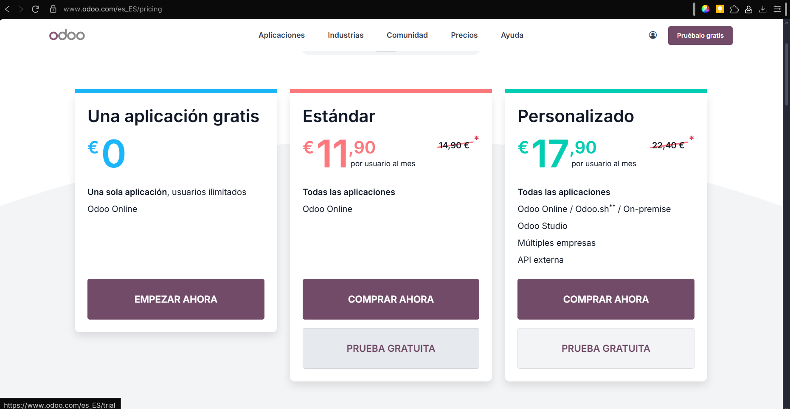
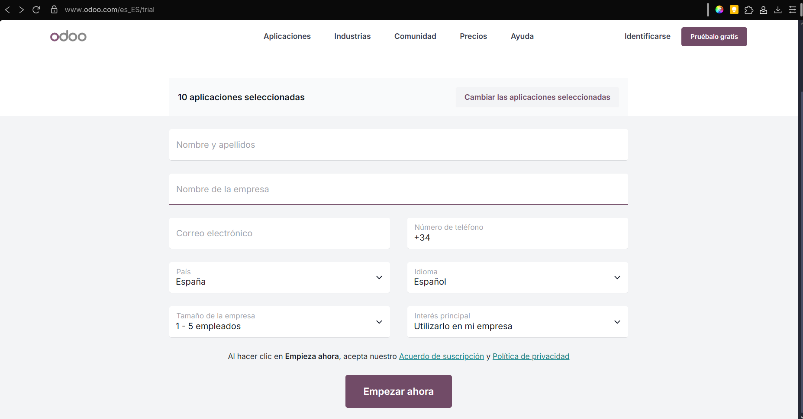
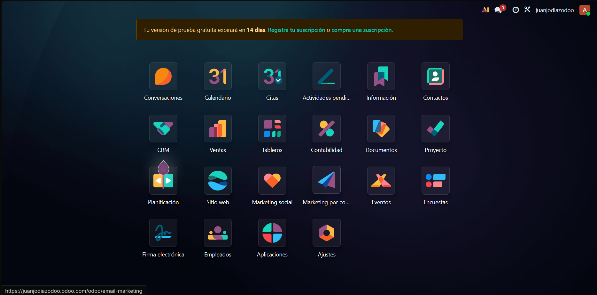
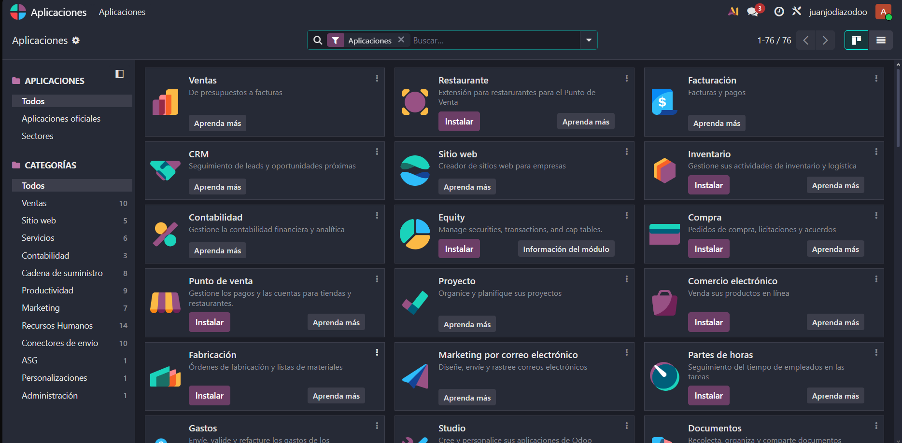

# 03 — Instalación y prueba (15 días) / Alta e instalación de apps

## Requisitos previos

- Navegador actualizado.
- Cuenta de correo para alta.

## Pasos

1. **Selección de applicaciones** (hay un máximo de 10 aplicaciones en la prueba gratuita).
   Lo primero que debes de hacer es crear una cuenta de odoo, una vez la tengas debes de hacer click en el apartado de la zona superior derecha donde dice "Pruébalo gratis".
   Tras esto se abrirá una pestaña de selección de precios. En esta guía de instalación he usado la versión standard con su preuba gratuita de 15 días.
   
   Después, se abrirá la pestaña de selccion de aplicaciones, donde nosotros vamos a elegir las siguientes: *Sitio web, Eventos, CRM, Ventas, Facturación, Contabilidad, Proyecto, Documentos, Marketing por correo electrónico y Marketing Social*.
   
   Tras seleccionar los modulos deseados (con un maximo de 10 por la prueba gratuita), se muestra una pantalla donde debes de introducir los datos de la empresa y personales.
   
2. **Creación de la Base de Datos de Odoo**
   Tras haber seleccionado los modulos deseados se abrirá una pestaña con una selección de configuración básica, ahí debes elegir lo que mejor se ajuste a tus necesidades.
   
   En esta guía de instalación he elegido la opción de saltar y empezar desde cero.
   Es importante que al llegar a este paso confirmes tu cuenta de Odoo, pues sino tu Base de Datos se borrará a las 3 horas.
   También se puede realizar una instalación local, bajando a la parte inferior de la página web hay un apartado con el nombre "Descargas" donde tan solo tienes que introducir tus datos y los de tu empresa, y elegir tu sistema operativo.
3. **Instalar/Desinstalar apps** desde *Aplicaciones* (¡cuidado con los datos al desinstalar!).
   Para instalar o desinstalar aplicaciones tan solo tienes que ir al tablero de tu base de datos de odoo y seleccionar la opción de aplicaciones, lo cual abrirá una pestaña donde elegir qué aplicaciones quieres añadir.
   
   
   Para instalar nuevas aplicaciones, tan solo hay que hacer click en el botón "Instalar" en la aplicación deseada. Y para desinstalar una aplicación debes de hacer click en los tres puntos situados en la esquina superior derecha del recuadro de la aplicación deseada, lo cual mostrará un overlay con la opción desinstalar. Al introducir esa opción, debes de elegir qué documentos borrar, así cómo confirmar que quieres desinstalar la aplicación.
   

## Resultado esperado

- Acceso al panel principal con las apps instaladas.
- Ser capáz de desinstalar aplicaciones.
