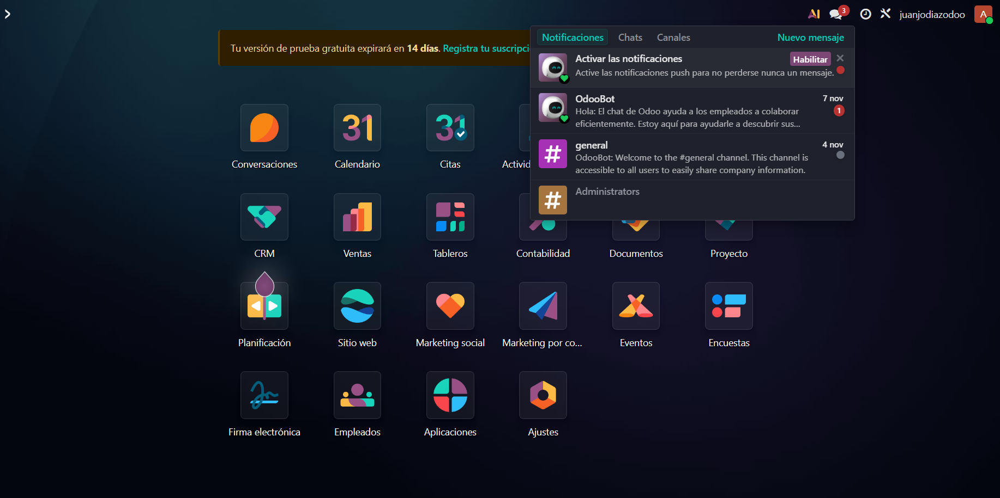
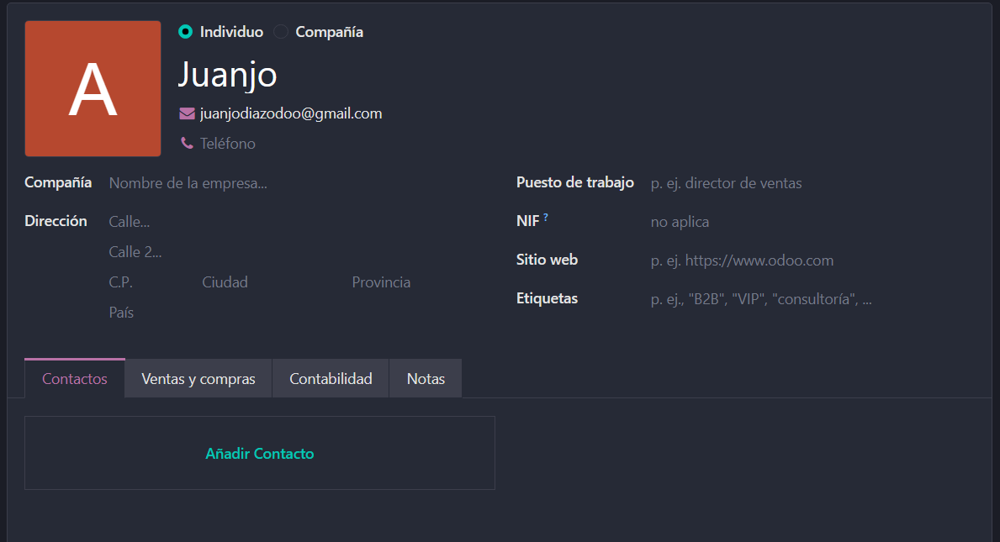
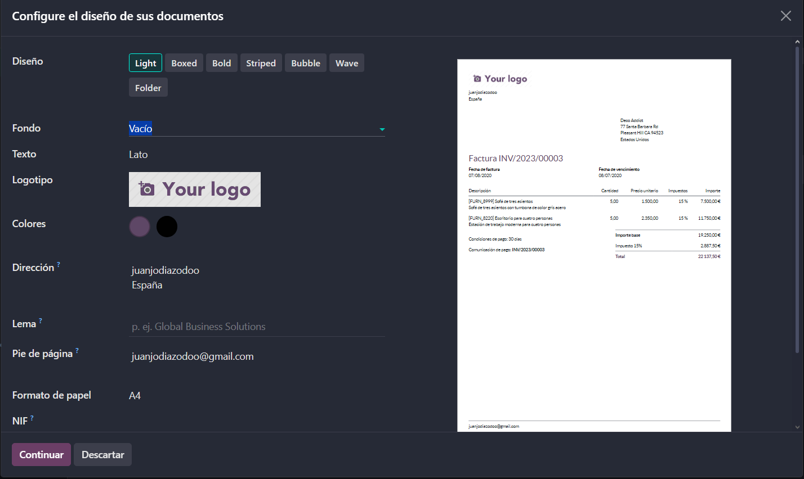

# 04 — Ajustes generales

1. **Activar **notificaciones** y (opcional) **PWA**.**
   Para activar las notificaciones tan solo tienes que hacer click en la opción con el mismo nobre en el apartado de notificaciones.
   
   Para activar el PWA habría que hacer lo mismo pero con la opción de "descargar Odoo" la cual no descarga la base de datos de forma local, sino que permite un más facil acceso a la base de datos creada.
2. **Perfil: modo oscuro, datos, **2FA**, firma email, notificaciones en Odoo.**
   Para configurar tu perfil tan solo debes de hacer click en el icono del mismo, y desde el overlay que se abre hay disponibles multiples opciones las cuales voy a explicar a continuación.
   Modo oscuro: para activar el modo oscuro debes de ir a preferencias, y en tema darle al que prefieras. En esta pestaña también puedes activar las notificaciones en Odoo y la firma email.
3. 
   Datos personales: para añadir los datos personales en Odoo 19 debes de irte al apartado de contactos, donde, si haces click en tu perfil puedes editar información pública tales como el puesto.
   
   La función de 2FA (Two Factor Authentification) está disponible en el apartado de seguridad, dentro de la zona de preferencias, y para activarlo tan solo tienes que scannear un código QR en tu aplicación de autenticación elegida.
4. ****Usuarios y compañías**: roles por módulo; en Enterprise se paga por usuario.**
   Desde el apartado de ajustes, en Odoo, puedes crear compañías, dentro de las cuales tienes a los usuarios, que les puedes asignar roles, los cuales determinan sus permisos dentro de cada módulo. Además, en los planes de pago de Odoo se paga por cada usuario.
   
5. ****Idiomas.**
   Hay dos formas para añadir idiomas a Odoo, desde tu perfil (cómo ya se ha mostrado) y desde los ajustes generales(lo que permitirá a cualquier usuario acceder a ese idioma.
   
6. **Diseño de documentos** (plantillas de factura).
   Justo debajo de la opción de idiomas en los ajustes generales, puedes acceder a la pestaña de "compañías", donde hay una opción llamada diseño de documentos. Al abrir esa opción aparece un Overlay que te permite editar la estructura que tomarán tus documentos.
   
7. ****Emails de resumen**: periodicidad y destinatarios.**
   La última opción de ajustes generales que voy a reconocer en esta guía es el de los emails de resumen.
   Odoo tiene un a opción en sus ajustes generales (justo debajo del diseño de los documentos) que determina cada cuanto se envian correos de resumen de lo ocurrido con tu aplicación en un periodo espicificado. La frecuencia de estos puede ser cambiada y el predeterminado es diariamente. En este ejemplo lo voy a configurar para que pase de diariamente a mensualmente.
   
