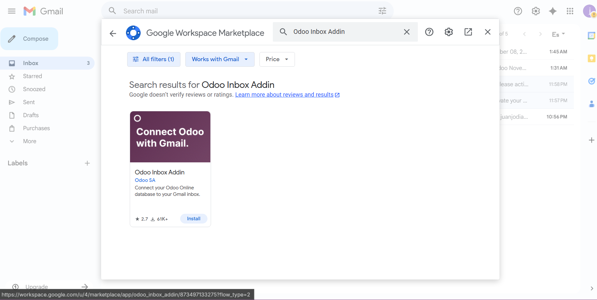
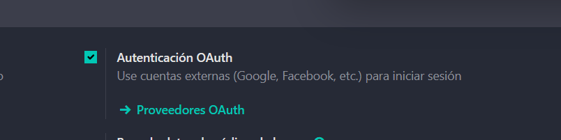
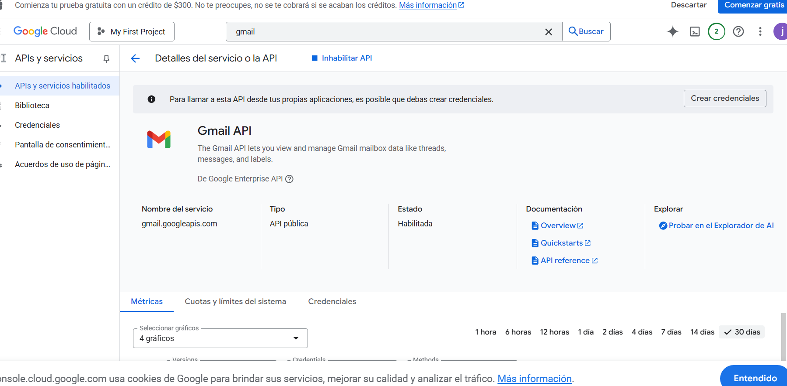
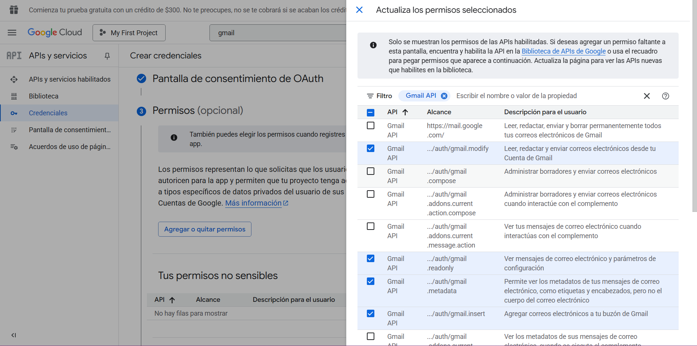
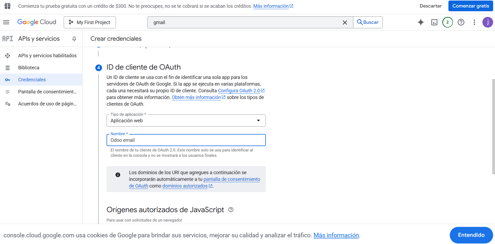
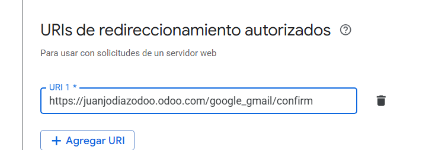
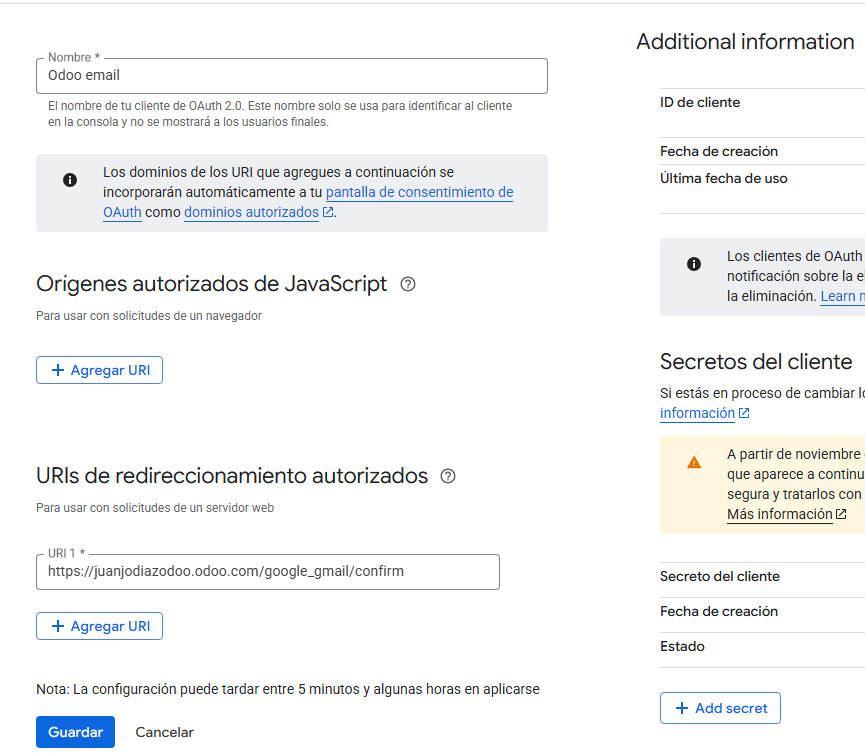
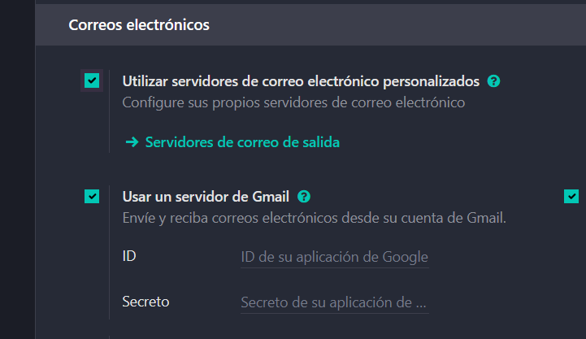

# 05 — Integración con Gmail (OAuth GCP + Add-on)

## Requisitos

- Cuenta Google Cloud (GCP).

## Pasos

1. **Activar plugin de correo** en Odoo e instalar *Odoo Inbox Add-on* en Gmail.
   Para activar el plugin en Odoo, debes dirigirte a ajustes generales, una vez allí debes de bajar hasta la sección de integraciones, y habilitar la opción de "Plugin de Correo"
   
   Para que funcione el plugon, tienes que ir a tu cuenta de gmail, y desde ahí, en el margen derecho darle a la opción que muestra un "+", lo cual abrirá una tienda de add-ons para gmail. Ahí debes buscar Odoo Inbox Addin, e instalarlo.
   
2. En **Google Cloud Console**: habilitar *Gmail API*, crear **OAuth Client (Web)**, configurar **redirect URI** de Odoo.
   Lo primero que necesitas para vincular Odoo es marcar la casilla de OAuth en el apartado integraciones de la pestaña de ajustes generales.
   
   Después accede a "Proveedores Oauth (el cual estás justo debajo) y elige Google OAuth2.
   Una vez lo hayas hecho, dirígete a Google Cloud Console, donde debes crear un nuevo proyecto, en este caso lo llamaré Odoo Test. Seleccionalo cómo el proyecto activo, y busca en la barra de búsqueda "Gmail API", dale a "Habilitar" y debería de aparecer la siguiente pestaña: 
   Ahora debes de darle a "Crear credenciales", rellena los campos de "nombre de la aplicación" con el nombre que desees ponerle, y en los correos que te piden debes de ingresar tanto en contacto cómo en empresa el correo que hayas usado para odoo. Al confirmar llegarás a una parte donde te pide "agregar o quitar permisos". En este caso debemois de darle permisos a Odoo para que pueda hacer log-in así cómo los que se muestran en la captura:
   
   
   Después debes darle a "Actualizar", seguido de "Guardar y Continuar". Acto seguido continua hasta llegar a ID de Cliente de OAuth, donde debes seleccionar "aplicación web" y de poner el nombre de la web. Tal y como se muestra aquí:
   
   Lo siguiente es agregar un URl de Redireccionamiento, el cual debe de seguir esta estructura, pero reemplazando "juanjodiazodoo" por el nombre de tu base de datos y darle a "listo".
   
3. Copiar **Client ID/Secret** a Odoo (Gmail server settings) y **Guardar**.
   Tras haber seguido los pasos dictados anteriormente, en el apartado de "Credenciales" deberías de poder acceder a la credencial creada, que al hacerle click te lleva a la siguiente pestaña:
   
   Ahora, debes copiar el ID de cliente, para ponerlo en la pestaña de "Proovedores de OAuth" que abrimos antes, así cómo darle a "permitido" y guardar los cambios.
   Para lo siguiente debes de volver al apartado de "correos electronicos" de los ajuistes generales y marcar la casilla de "Utilizar servidores de correo electrónico personalizados" tras lo cual se mostrará una opción nueva de Usar un servidor de Gmail, donde debes de pegar tanto el ID de la aplicación, cómo el secreto. Tras esto ultimo debes guardar los cambios.
   
