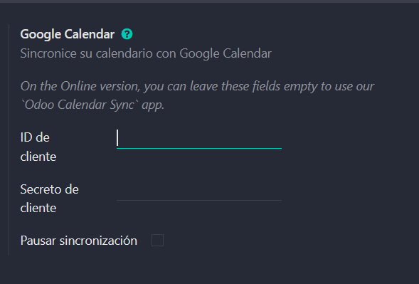
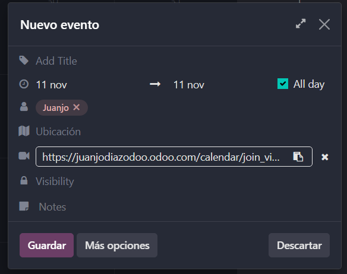
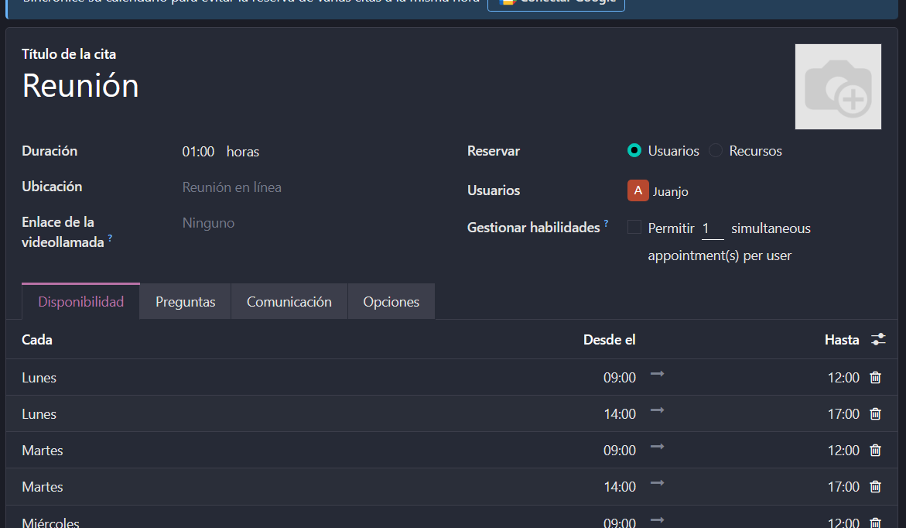
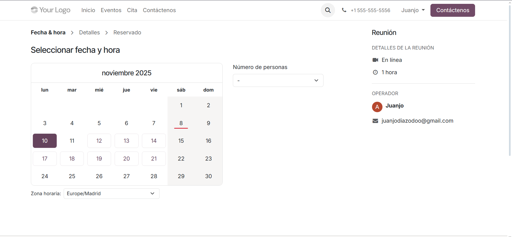

# 07 — Calendario y Citas

- Calendario (día/semana/mes) + disponibilidad del equipo.

  - El calendario de Odoo tiene una función en la que te permite ver sus contenidos con distintas vistas, por ejemplo la semanal (que es la predeterminada) cómo la mensual. Esto beneficia al usuario, pues cómo puedes ver tanto tus tareas y reuniones, cómo la de tus compañeros, te permite comprobar su disponibilidad sin necesitar preguntar directtamente o dudas.
- **Integración con Google Calendar** (API OAuth GCP).

  - Para integrar el calendario con google calendar hay que seguir los mismos pasos iniciales que para configurar el api de gmail. Estos son: crear un  nuevo proyecto en google cloud, crearle credenciales, nombrarlas de forma distinta para diferenciarlas y por ultimo, darle los permisos, que tendrán que ser los de openid, y todos los permisos de Google Calendar API.
  - Tras completar esa parte ahora tan solo hay que copiar el ID de usuario, y dirigirte a sjustes generales, seguido de ajustes del calendario, donde hay que pegar tanto el user ID como el secreto.
    
- **Odoo Meet** (videollamadas) o enlaces externos.

  - Puedes crear eventos en el calendario de Odoo muy facilmente tan solo haciendo click derecho sobre un momento en el calendario te muestra las siguientes opciones:
    
  - Lo especial de Odoo es el icono de la cámara, pues odoo tiene una alternativa a google meeto o a zoom integrada, pero aun aaí también permite que dopnde está pùesto el enlace coloques otro de una aplicación externa.
- **Módulo Citas** (Enterprise): enlaces públicos, buffers, preguntas previas.
    El modulo citas en Odoo permite simplificar el proceso de crear un evento cómo una cita. Esto lo hace a traves de un acopnfiguración para decir cada cuanto tiempo aceptas citas, así cómo el tiempo de antelación para poder pedir una cita.
    
    También permite a los usuarios de tu página web reservar citas a través de un calndario que solo muestra los momentos libres:
    
    Así como enviar preguntas previas a una cita, todo desde Odoo.