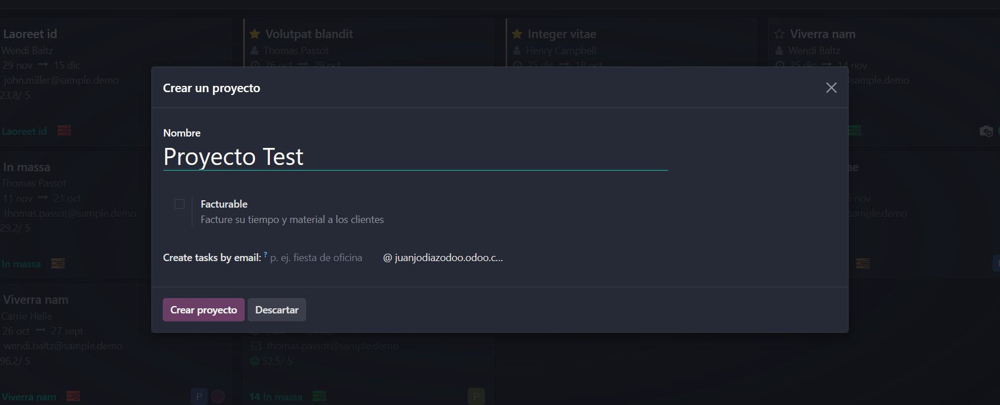
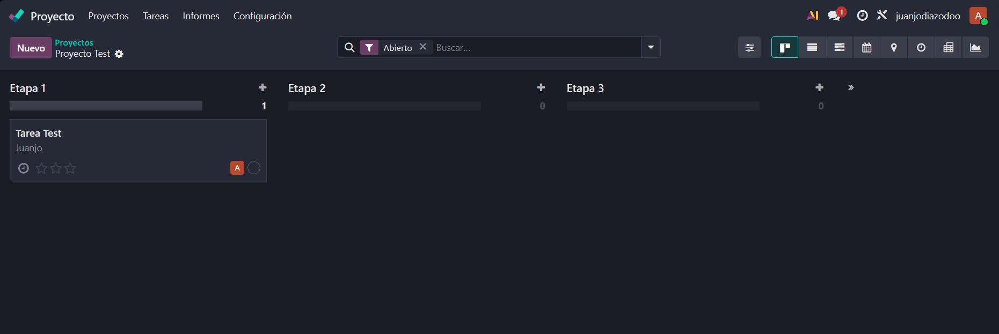

# 08 — Proyectos (Kanban)
El módulo Proyectos en Odoo permite planificar, ejecutar y controlar el trabajo por medio de proyectos, tareas y subtareas. Su interfaz principal es tipo Kanban, similar a herramientas como Trello, pero integrada con el resto del ERP (ventas, facturación, hojas de tiempo, helpdesk). En este capítulo veremos cómo crear proyectos, gestionar tareas, configurar fases (etapas), usar subtareas, dependencias e hitos, y cómo aprovechar las vistas y reportes para controlar la ejecución.
## Crear un proyecto
Para crear un proyecto dirígete a Proyectos > Proyectos y pulsa "Nuevo Proyecto". Se abrirá una ficha donde configurarás los datos básicos:
- Nombre del proyecto.
- Si es facturable y la política de facturación (por tareas, por horas, por hitos).
- Email asociado para crear tareas por correo.
- Plantilla del proyecto (si ya tienes plantillas predefinidas).

## Interfaz Kanban y etapas
Al entrar en un proyecto accederás a la vista Kanban con las diferentes etapas que representan el flujo de trabajo. Las etapas son configurables y pueden aplicarse a todo el proyecto o a tareas concretas.
Puedes arrastrar y soltar tareas entre etapas para actualizar su estado rápidamente.

Cada tarjeta de tarea incluye información clave: título, asignado, porcentaje de progreso, etiquetas, fecha de vencimiento y prioridad. Abriendo la tarjeta puedes añadir descripción larga, archivos adjuntos, conversaciones y notas.
## Crear y gestionar tareas
Para añadir una tarea dentro del proyecto pulsa "Nueva Tarea". En la ficha de la tarea puedes:
- Asignar responsable(es).
- Establecer fechas de inicio y fin.
- Añadir etiquetas (tags) y prioridad.
- Añadir subtareas o checklist para dividir el trabajo.
- Vincular horas y hojas de tiempo.
- Establecer la visibilidad (privado o público dentro del proyecto).
Dentro de la tarea encontrarás el registro rápido de actividades (chatter) donde comentar, registrar notas internas o enviar mensajes a colaboradores.
### Subtareas y checklist
Las subtareas permiten dividir una tarea en unidades más pequeñas y asignarlas a distintos miembros. Son útiles para micro-gestión y para generar automáticamente registros de tiempo cuando se registran las horas por subtarea.
Usa checklists cuando necesites una lista de control que no requiera asignación independiente.
## Dependencias y hitos
Odoo Projects permite establecer dependencias entre tareas (p. ej., tarea B no puede comenzar hasta que A termine). Las dependencias ayudan a planificar el cronograma y a detectar bloqueos.
Los hitos (milestones) son tareas especiales que marcan logros importantes del proyecto (entregas, aprobaciones, lanzamientos). Visualízalos en la vista de lista o Gantt para seguimiento estratégico.
## Tareas recurrentes
Si una tarea se repite (mantenimiento, backup, informes), puedes programar recurrencia desde la ficha de tarea. Configura la frecuencia (diaria, semanal, mensual), fecha de finalización y si se generan nuevas tareas automáticamente.
## Vistas y filtros
El módulo ofrece varias vistas para trabajar con tus proyectos:
- Kanban (tarjetas) — ideal para flujos de trabajo visuales.
- Lista — para edición rápida y exportación.

