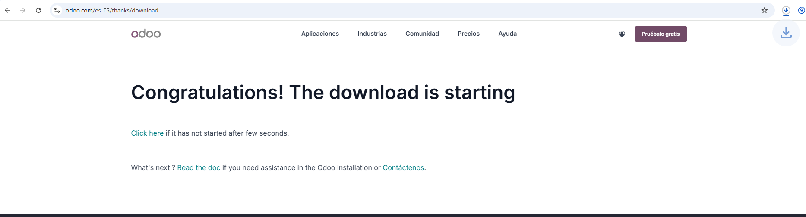

# 03 — Descarga del instalador de Odoo

1. Accede a la **web oficial de Odoo** y localiza el **instalador para Windows**.
   - 
   Lo primero que debes hacer es acceder a la página web de Odoo, añadir los datos de la empresa y darle a descargar, debería de salir esto:
   

2. Descarga la **versión estable** que vayas a usar en clase (anota la **versión exacta**).
   - 
   Debes de seleccionar la versión estable que desees. En este caso usaremos la version comunity de Odoo 19

> Resultado esperado: fichero `Odoo-<version>-setup.exe` en tu equipo.
