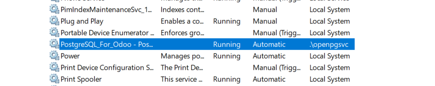

# 04 — PostgreSQL en Windows

> Odoo requiere **PostgreSQL**. Según instalador y versión, se incluye o puede requerir instalación separada.

1. Verifica si el instalador de Odoo **instala PostgreSQL** automáticamente.
Si, el instalador de Odoo descarga PostgreSQL automáticamente.

2. Comprueba que el **servicio de PostgreSQL** está en ejecución.
Al entrar enb "servicios" puedes revisar si está activado, aquí hay un ejemplo de PostgreSQL funcionando.

> Resultado esperado: PostgreSQL instalado y funcionando (usuario/puerto guardados).
