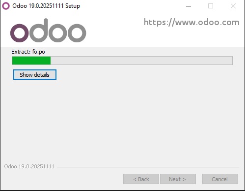
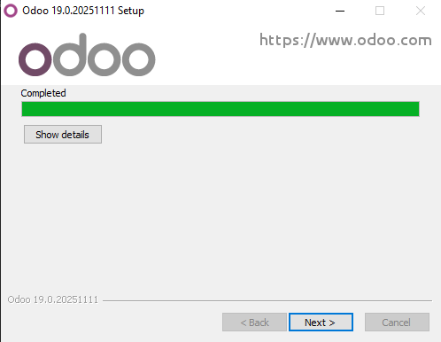

# 05 — Instalación de Odoo

1. Ejecuta el instalador (`.exe`) como **Administrador**.
2. Acepta la licencia y elige **ruta de instalación**.
3. Si se solicita, configura la conexión a **PostgreSQL**.
4. Completa la instalación y finaliza el asistente.
Si no hay ningún error, la instalación debería de verse así:

Y al terminar debería ser así:

   - 

> Resultado esperado: Odoo instalado, acceso a accesos directos/servicio.
