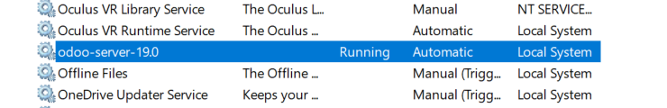

# 07 — Ejecución y servicio

1. Inicia Odoo mediante el **servicio de Windows** o acceso directo.  Verifica el estado del servicio (**Servicios** de Windows).
Se puede revisar el estado del servidor de Odoo a traves de "servicios" de windows.

> Resultado esperado: Odoo en ejecución local.
