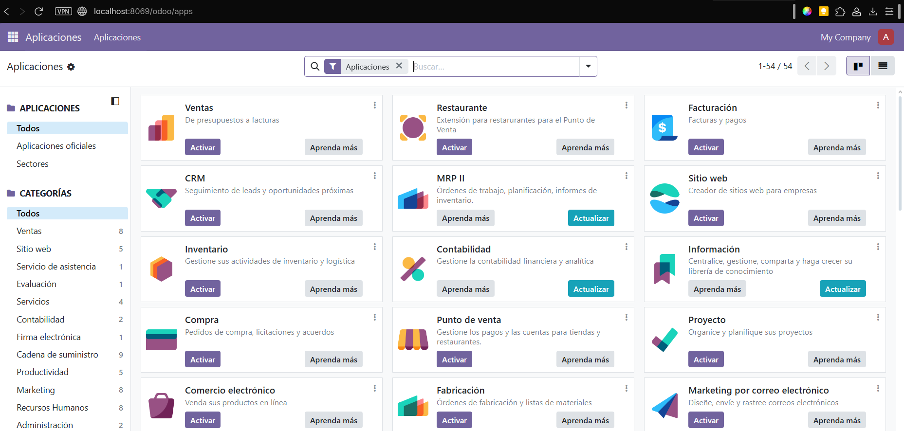

# 08 — Creación de base de datos de prueba

1. Accede a `http://localhost:8069` en tu navegador.
Tan solo hay que poner la ruta en el navegador (microsoft edge parece ser el que mens problemas da) y darle a enter.
2. Crea una **base de datos nueva** (admin email y contraseña).
Para crear una base de datos tan solo tienes que acceder a "gestión de bases de datos" y darle a "crear base de datos" 

3. Elige módulos iniciales si procede.
Nada más crear una base de datos podrás acceder a la elección de módulos, la cual funciona igual que en Odoo en línea.

> Resultado esperado: BD de prueba creada y primer acceso.
