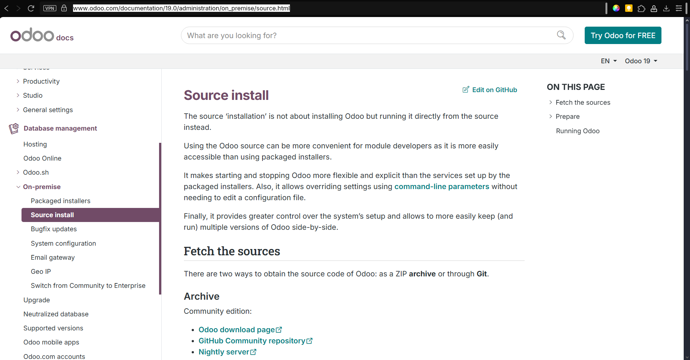

# 99 — Bibliografía y fuentes

Incluye aquí las fuentes que has usado para guiarte (oficiales y artículos técnicos). Ejemplos:
- Documentación oficial de Odoo (versión que hayas usado).
- Guías de instalación en Windows de Odoo (sitio oficial).
https://www.odoo.com/documentation/19.0/administration/on_premise/source.html

- Documentación de PostgreSQL para Windows.
- Artículos técnicos (no comerciales) sobre instalación/servicio en Windows.

> Recuerda: añade **capturas con la URL visible** al consultar guías online.
