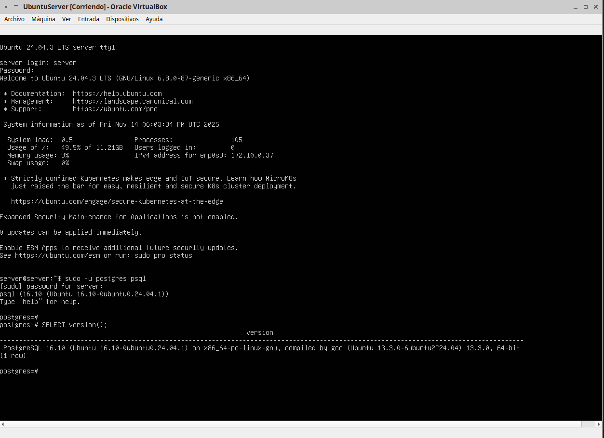

# 04 — PostgreSQL en Linux

1. Instala PostgreSQL desde repos:
   ```bash
 sudo apt-get -y install postgresql
   ```
2. Verifica el servicio:
   ```bash
sudo -u postgres psql
SELECT version();
   ```


> Resultado esperado: PostgreSQL instalado y activo.
