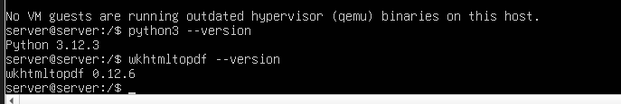

# 05 — Dependencias (Python, wkhtmltopdf, librerías)

1. Instala Python y paquetes de compilación:
   ```bash
   sudo apt install build-essential
   sudo apt -y install python3 python3-pip python3-venv build-essential libxslt1-dev      
   libzip-dev libldap2-dev libsasl2-dev libjpeg-dev libpq-dev
   ```
2. Instala **wkhtmltopdf** compatible (para reportes PDF).
   ```bash
   sudo dpkg -i wkhtmltox_0.12.5–1.focal_amd64.deb
   ```
3. Verifica versiones:
   ```bash
   python3 --version
   wkhtmltopdf --version
   ```
   Debería de decir lo siguiente
   

> Resultado esperado: dependencias instaladas y comprobadas.
