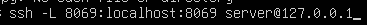

# 09 — Creación de base de datos de prueba

1. Accede a `http://localhost:8069`.
Para hacer esto debes de hacer un tunel de ssh con la base de datos creada, para ello usa:

2. Crea una **base de datos nueva** con email/contraseña admin.
Para ello usa http://127.0.0.1:8069/web/database/manager y sale una pestaña donde puedes acceder a todo:

3. Selecciona módulos iniciales si procede.

> Resultado esperado: BD de prueba creada y primer acceso.
